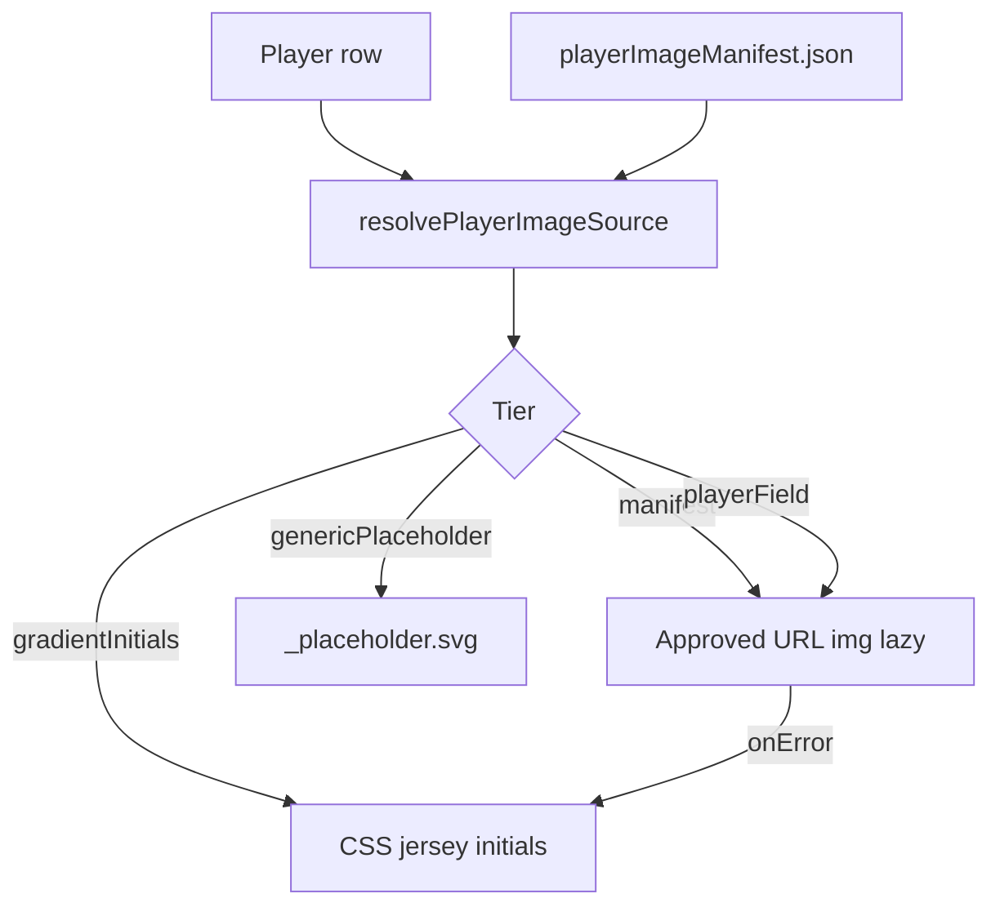

# Player image system plan (FootyBrain)

Production-safe player photos: manifest-first, allowlisted URLs, placeholders by default. **No Transfermarkt scrape or hotlink** — aligned with [PLAYER_IMAGE_POLICY.md](./PLAYER_IMAGE_POLICY.md) and [PROJECT_BRIEF.md](./PROJECT_BRIEF.md).

## Goals

| Goal | Status |
|------|--------|
| Safe manifest for licensed assets | **Shipped** — `src/data/playerImageManifest.json` |
| Local `/images/*` hosting | **Supported** |
| Approved CDN (Wikimedia) | **Allowlist** in manifest |
| Placeholder hierarchy + lazy load + `onError` fallback | **Shipped** — `PlayerVisual` + `playerImage.js` |
| Validators + npm script | **Shipped** — `validate:player-images` |
| Bulk licensed import | **Next wave** (see § Import waves) |

## Architecture



### Placeholder hierarchy (runtime)

1. **manifest** — `entries[playerId]` in `playerImageManifest.json` (preferred for production)
2. **playerField** — `imageUrl` on the player row (same URL rules as manifest)
3. **genericPlaceholder** — `/images/players/_placeholder.svg`
4. **gradientInitials** — themed jersey initials (no network)

### URL policy (`src/utils/playerImageUrlPolicy.js`)

- **Local:** paths under `/images/` only (no `..`)
- **CDN:** `https://` on hosts in `approvedCdnHosts` (default: `upload.wikimedia.org`, `commons.wikimedia.org`)
- **Blocked:** Transfermarkt, FotMob, stock-photo domains, `googleusercontent`, etc.

Validators and runtime share this module; scripts re-export via `scripts/player-image-rules.js`.

## Files

| Path | Role |
|------|------|
| `src/data/playerImageManifest.json` | Source manifest (bundled at build) |
| `public/data/player-image-manifest.json` | Tooling mirror (sync with npm script) |
| `src/utils/playerImageManifest.js` | Resolve tier + metadata |
| `src/utils/playerImage.js` | `` attrs, lazy loading, dev attribution warnings |
| `src/components/PlayerVisual.jsx` | Photo vs placeholder, `onError` → initials |
| `public/images/players/` | Licensed files (`{player-id}.webp` recommended) |
| `scripts/validate-player-image-manifest.js` | CI/local validation |
| `scripts/sync-player-image-manifest.js` | Refresh public mirror |

## Adding a licensed image

### Option A — Manifest entry (recommended)

1. Add file: `public/images/players/{player-id}.webp`
2. Edit `src/data/playerImageManifest.json`:

```json
"entries": {
  "erling-haaland": {
    "source": "local",
    "path": "/images/players/erling-haaland.webp",
    "alt": "Erling Haaland, Manchester City forward",
    "credit": "Photographer or rights holder",
    "license": "CC BY-SA 4.0",
    "imageSource": "Wikimedia Commons",
    "width": 640,
    "height": 800
  }
}
```

3. Run:

```bash
npm run sync:player-image-manifest
npm run validate:player-images
npm run build
```

Manifest wins over inline `imageUrl` on the same player id.

### Option B — Player field only

Set `imageUrl`, `imageCredit`, `imageLicense` on the player in sample/overlay data (same URL rules). Use when a one-off row is easier than manifest maintenance.

### Option C — Approved CDN

```json
"source": "cdn",
"path": "https://upload.wikimedia.org/wikipedia/commons/.../Example.jpg",
"credit": "...",
"license": "CC BY-SA 4.0"
```

New CDN hosts require manifest `approvedCdnHosts` update + policy review — do not add arbitrary domains.

## npm scripts

| Script | Purpose |
|--------|---------|
| `npm run validate:player-images` | Manifest schema, URLs, public mirror sync |
| `npm run sync:player-image-manifest` | Copy src manifest → `public/data/` |

Wire `validate:player-images` into data CI when manifest entries exist (optional today: 0 entries).

## Licensing risks (remaining)

| Risk | Mitigation |
|------|------------|
| **Personality / publicity rights** | Even CC photos may need context; avoid commercial misrepresentation; legal review before scale |
| **Wikimedia attribution** | Require `credit` + `license` on every manifest entry; show in profile when UI attribution ships |
| **Wrong license on upload** | Manual review per wave; validator warns on missing credit/license |
| **CDN link rot** | Prefer local `/images/` for production; CDN as secondary |
| **Scraper regression** | Forbidden keys + disallowed URL patterns in validators |
| **Team crests / league logos** | Separate from player manifest; `resolveLicensedAssetUrl` for badges — same host/path rules |

Current dataset: **all player `imageUrl` null** — placeholders only; **no production licensing exposure** until import wave 1.

## Import waves (next steps)

## Phase 1 — Real image rollout (starting now)

**Goal:** ship real licensed images for the **top 100 quiz-ready players first** (ranked by `importanceScore`), without changing the rest of the dataset.

**Status:** targets are defined in `src/data/playerImageManifest.json` under `phase1.topQuizReadyPlayerIds`; **no photo assets are bundled yet**, so the app remains on placeholders by default until licensed files are added.

### Phase 1 rules (non-negotiable)

- **No Transfermarkt hotlinking**: TM URLs are blocked in `playerImageUrlPolicy.js`.
- **Manifest-first**: add images via `playerImageManifest.json` entries (preferred) or `imageUrl` fields only when necessary.
- **Lazy + responsive**: `PlayerVisual` uses native `loading="lazy"`, intrinsic dimensions, and `sizes` hints; `onError` always falls back to placeholders.
- **Safe fallback hierarchy**: manifest → player field → generic placeholder → gradient initials.

### How Phase 1 images should be added

- **File location**: `public/images/players/{player-id}.webp` (preferred) or `.jpg`.
- **Manifest entry**: `entries[{playerId}] = { source:'local', path:'/images/players/{player-id}.webp', credit, license, ... }`
- **Sync + validate**:

```bash
npm run sync:player-image-manifest
npm run validate:player-images
```

### Wave 1 — Pilot (10–20 players)

- Pick high-traffic featured players (home hero, collections)
- Source: own assets or Wikimedia with documented license
- Local WebP under `public/images/players/`
- Manifest entries only (no TM fields in preview JSON)

### Wave 2 — Featured + quiz faces

- Expand manifest; optional `imageSrcSet` for card vs thumb widths
- Add profile attribution line in `PlayerProfile` (credit + license)
- Pre-generate thumb variants (52×64 display) to reduce bytes

### Wave 3 — Operational scale

- Script: `scripts/import-player-images.js` (copy files + append manifest + sync)
- Image audit in `validate:app-ready-preview` when `imageUrl` non-null
- Consider dedicated CDN bucket with same allowlist policy

## Explicit non-goals

- Scraping or hotlinking Transfermarkt (or any stats site) for photos
- Google Image search, Getty, Shutterstock, or EA/FC asset packs
- Automatic photo fetch from preview CSV pipelines

## Related docs

- [PLAYER_IMAGE_POLICY.md](./PLAYER_IMAGE_POLICY.md) — allowed/disallowed sources
- [PRODUCTION_LAUNCH_PLAN.md](./PRODUCTION_LAUNCH_PLAN.md) — launch checklist
- [PERFORMANCE_SCALING_PLAN.md](./PERFORMANCE_SCALING_PLAN.md) — lazy images, bundle size
